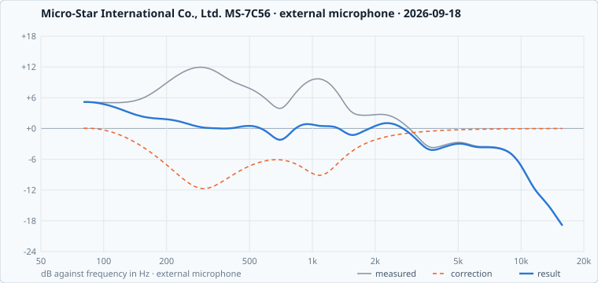

# Micro-Star International Co., Ltd. MS-7C56

1 shared calibration for this machine, best first. The Omarchy Speaker Calibrator finds these by itself on a matching machine.

**Vendor tuning:** none yet, the best calibration cannot become one yet: it has not been checked.

## `2026-09-18-external-eaaacaeb30`

**fair**, score **55** · external microphone · measured 2026-09-18 · plugin 1.0.2 · not checked · [#15](../../../../../issues/15)

