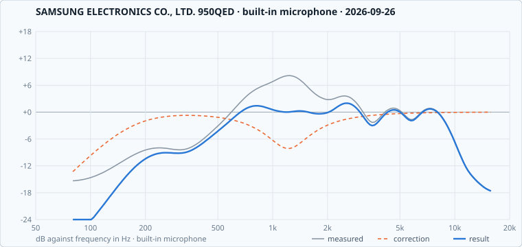

# SAMSUNG ELECTRONICS CO., LTD. 950QED

1 shared calibration for this machine, best first. The Omarchy Speaker Calibrator finds these by itself on a matching machine.

**Vendor tuning:** [rendered for Omarchy](../../../tunings/samsung-electronics-co-ltd/950qed/README.md) from `2026-09-26-builtin-b5d2cc222e`.

## `2026-09-26-builtin-b5d2cc222e`

**good**, score **60** · built-in microphone · measured 2026-09-26 · plugin 1.2.0 · checked: pass, 5.6 → 4.0 dB from target · [#11](../../../../../issues/11)

