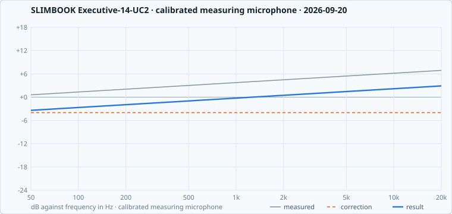

# SLIMBOOK Executive-14-UC2

2 shared calibrations for this machine, best first. The Omarchy Speaker Calibrator finds these by itself on a matching machine.

**Vendor tuning:** none yet, rendering it failed: Measuring needs lsp-plugins-lv2, which this machine does not have yet. The panel can install them for you, or run:  omarchy pkg add lsp-plugins-lv2.

## `2026-09-20-external-95d0f4e087`

**good**, score **71** · external microphone · measured 2026-09-20 · plugin 1.1.0 · checked: warning, 8.0 → 4.3 dB from target · [#5](../../../../../issues/5)

## `2026-09-20-calibrated-c58421207f`

**good**, score **61** · calibrated measuring microphone · measured 2026-09-20 · plugin 1.2.0 · not checked · [#3](../../../../../issues/3)

